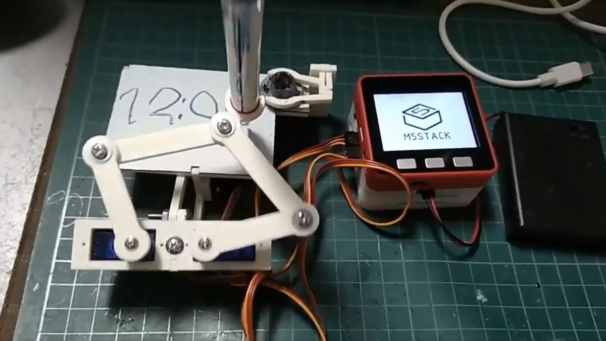
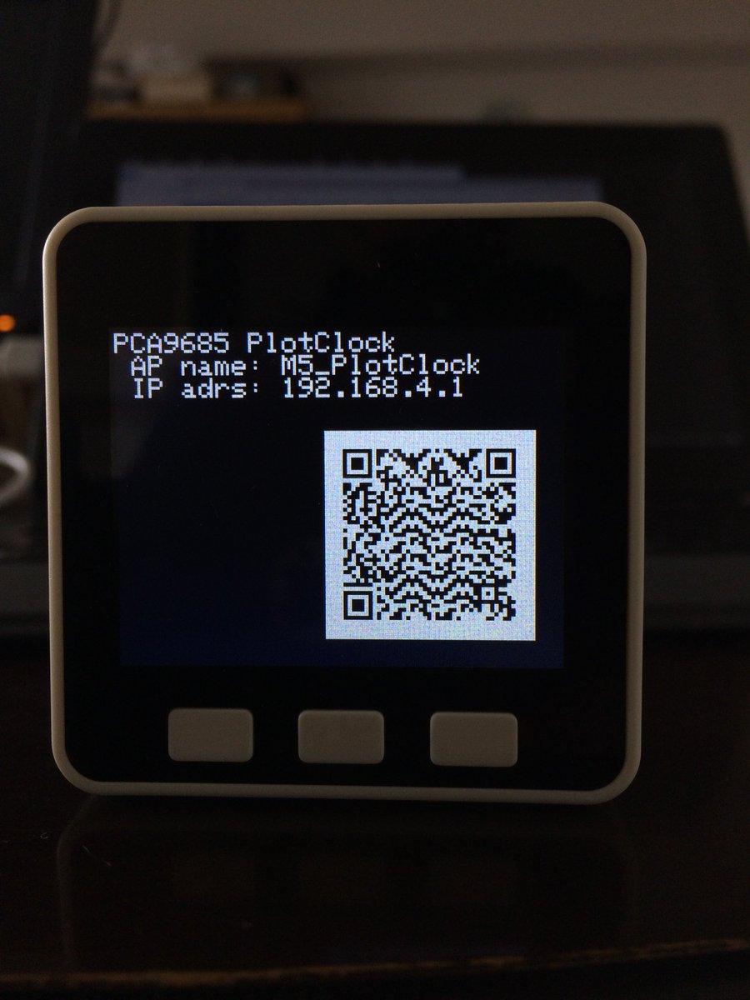

# PlotClock with M5Stack

M5Stack Plotclock with PCA9685 Servo PWM Driver.

- Wifi Setting with Web browser by using QRCode.
- Time can be set using NTP server

Screen shot of Wifi setting.

## Movie
https://github.com/tomorrow56/M5Stack_Plotclock/blob/master/img/PLotclock.mp4

## STL Data
https://www.thingiverse.com/thing:248009

## The library used in this work

### M5Stack-SD-Updater
https://macsbug.wordpress.com/2018/03/12/m5stack-sd-updater/

### Adafruit PCA9685 PWM Servo driver
https://github.com/adafruit/Adafruit-PWM-Servo-Driver-Library

### TimeLib
https://forum.arduino.cc/index.php?topic=415296.0

### Wifi Manager for ESP32
https://github.com/zhouhan0126/WIFIMANAGER-ESP32
https://github.com/zhouhan0126/DNSServer---esp32
https://github.com/zhouhan0126/WebServer-esp32

M5Stack-SD-Updater
https://macsbug.wordpress.com/2018/03/12/m5stack-sd-updater/
